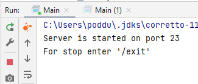
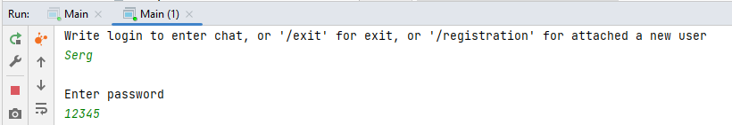

# Курсовой проект "Сетевой чат"

### Описание
Приложение выполнено в виде Maven проекта с двумя модулями: серверной и клиентской частей.
Для настройки клента и сервера используются файлы с именем Settings.txt в каждом из модулей.
В серверной части в файле настраивается номер порта сервера, а также пути сохранения файлов логгирования и сохранения состояния сервера.
Настройки клиента содержат адрес хоста и порт для подключения, а также путь к файлу логгирования.

### Сервер

Запуск сервера выполняется в классе Main модуля ServerPart. После активации в консоли выводится номер порта подключения.
Остановку сервера предлагается выполнить путем ввода команды '/exit' в консоли сервера.
При этом сервер сохраняет свое состояние в файле 'storage.gson' по пути, указанному в настройках.

### Клиент

Аналогично серверу, активация клиента производится из класса Main модуля ClientPart при работающем сервере.
После подключения клиента сервер предложит:
* ввести логин для начала авторизации;
* выйти без авторизации;
* зарегистрироваться в качестве нового пользователя.

Все сообщения и события дублируются в файл 'log.txt'.

Для выхода из чата необходимо в консоль ввести команду '/exit'.

